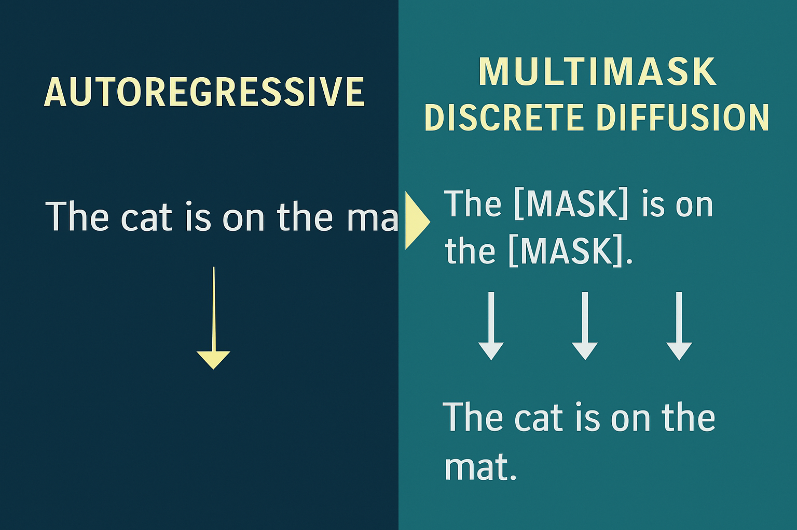

# Generative AI: Introduction to Diffusion Models for Text Generation

    

[img source:](https://matstoian.com/)
 

---

## Project Description

The project comes from the on-line course: [Generative AI: Introduction to Diffusion Models for Text Generation](https://www.linkedin.com/learning/generative-ai-introduction-to-diffusion-models-for-text-generation/what-is-natural-language-generation-29723010?autoSkip=true&resume=false&u=35754684).

It introduces you to diffusion models, which are popular with image generation, and how you can apply these models in natural language generation (NLG) tasks. It explores how diffusion models work as an alternative to traditional autoregressive approaches and develop your understanding of their unique advantages in generating diverse and controllable text outputs.

### What It Involves

In Google Colab Python based notebooks, I built and fine-tuned text diffusion models, worked with popular implementations on platforms like Hugging Face, and gained practical experience applying cutting-edge techniques to real-world text generation challenges.

#### What I did:

- Learned the fundamentals of Generative AI and its specific applications in Natural Language Generation (NLG), including identifying various subtasks within text generation.

- Compared and contrasted diffusion models with autoregressive models for text generation, clearly articulating the distinct advantages and challenges of each approach.

- Buillt a basic text diffusion model from scratch, utilizing pre-trained BERT embeddings and understanding the essential roles of noise addition, denoising, and text decoding.

- Fine-tuned a diffusion model to perform conditional text generation, enabling the model to produce text aligned with specific prompts or contextual inputs.

- Explored and interacted with advanced diffusion models, such as **Google Gemini Diffusion Model** and **Hugging Face**.

---

## Objective

The project contains the key elements:

- `Diffusion Models` generative deep learning models that work by gradually transforming simple noise into complex structured data,
- `Fine-tuning` retraing a pre-trained, pre-existing, an general knowlege AI model with a specialized dataset,
- `Google Gemini Diffusion Model` exploring and interacting with advanced diffusion models,
- `Hugging Face` using LLM models stored here,
- `Masked Language Models (MLM)` type of natural language processing (NLP) model that predicts missing or "masked" words in a sentence based on the surrounding context.
- `ModernBERT`, use newer improved version of Bidirectional Encoder Representations from Transformers (BERT),
- `Natural Language Generation (NLG)` enable AI to create human-like text from structured or unstructured data,
- `Natural Language Processing (NLP)` enable AI models to understand, interpret, and generate human language,
- `Python` script coding language
- `uv` package management including use of `ruff` for linting and formatting.

---

## Tech Stack

---

## Getting Started

Here are some instructions to help you set up this project

---

## Installation Steps

### Install Notebooks in the Notebooks Folder from the REPO

https://github.com/beenlanced/ai_text_gen_diffusion_models.git

Upload notebooks to **Google Colab** to run.

### Exploring Large Language Diffusion Models on Hugging Face

1. Log into Hugging Face - you may need to create an account

2. Search for LLaDA-8B-Instruct (https://huggingface.co/GSAI-ML/LLaDA-8B-Instruct)

   - Instruct models like LLaDa-8B-Instruct are fine tuned for following human instructions

3. Navigate to the spaces section:

   - What is a Hugging Face Space?

     - Answer: Hugging Face Spaces are a platform provided by Hugging Face for hosting and sharing machine learning (ML) demo applications and interactive projects. They offer a way for users to deploy and showcase their ML models and applications in an accessible, interactive format, without requiring users to set up their own hardware or development environment

   - On the right panel are the `Spaces` using this LLaDA-8B-Instruct model:

   - Click on multimodalart/LLaDA
     - Brings up an interface.
     - On this interface, you can start a conversation and see how text diffusion happens.

### Exploring Gemini Diffusion Models on Google

1. Go to deepmind.google/models/gemini-diffusion

2. Explore the page and demos

---

## Additional Information and Background Material

### Notebook 03_01_Buidling_Basic_Text_Diffusion_model.ipynb

This notebooks shows the basic principles of diffusion for text generation. It involves no training of the model.

### Notebook 03_02_Training_Text_diffusion_Model.ipynb

This notebook shows how to train a text diffusion model to improve text generation.

### Mask_Challenge_Assignment for_Text_Diffusion_Model.ipynb

This notebook shows how to use a pre-trained diffusion model for text generation. I used the LLM model
`tommyp111/modernbert-diffusion` as suggested by the LinkedIn Instructor and Hugging Face's documentation:
[tommyp111/modernbert-diffusion](https://huggingface.co/tommyp111/modernbert-diffusion)

### Helpful Instructional Links:

- Hugging Face's documentation: [tommyp111/modernbert-diffusion](https://huggingface.co/tommyp111/modernbert-diffusion)

- [Masked Language Modeling (MLM) with Hugging Face BERT Transformer](https://docs.pytorch.org/TensorRT/_notebooks/Hugging-Face-BERT.html)

---

### Final Words

Thanks for visiting.

Give the project a star (⭐) if you liked it or if it was helpful to you!

You've `beenlanced`! 😉

---

## Acknowledgements

I would like to extend my gratitude to all the individuals and organizations who helped in the development and success of this project. Your support, whether through contributions, inspiration, or encouragement, have been invaluable. Thank you.

Specifically, I would like to acknowledge:

- [Hema Kalyan Murapaka](https://www.linkedin.com/in/hemakalyan) and [Benito Martin](https://martindatasol.com/blog) for sharing their README.md templates upon which I have derived my README.md.

- The folks at Astral for their UV [documentation](https://docs.astral.sh/uv/)

---

## License

This project is licensed under the MIT License - see the [LICENSE](./LICENSE) file for details
